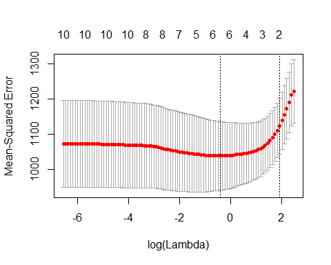
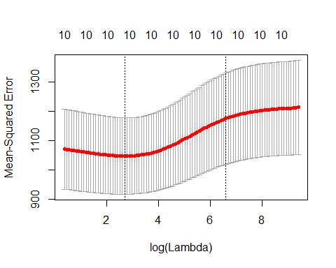

# Breast Cancer Regression Analysis

## **Objective:**
The objective of this project is to use R to train and compare the performance of two regression models for the prediction of breast cancer tumour characteristics. 

Using 5-fold cross-validation, the following regression models were trained and compared:
* Linear regression model with ridge regression regularization
* Linear regression model with lasso regularization

## **Tools:**
1.	R - glmnet

## **Screenshots:**

MSE vs. log(lambda) - Ridge Regression Model

MSE vs. log(lambda) - Lasso Model
